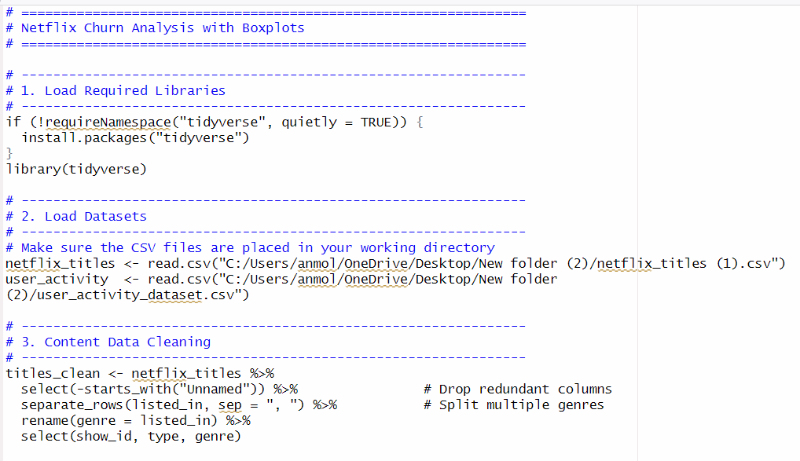
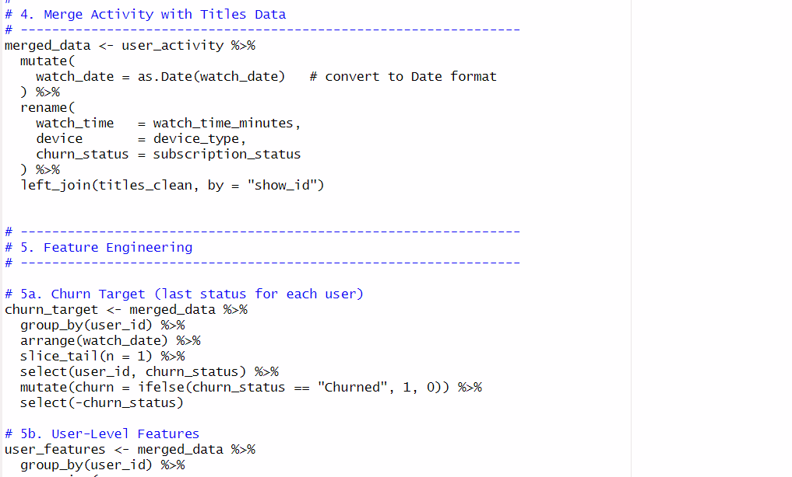
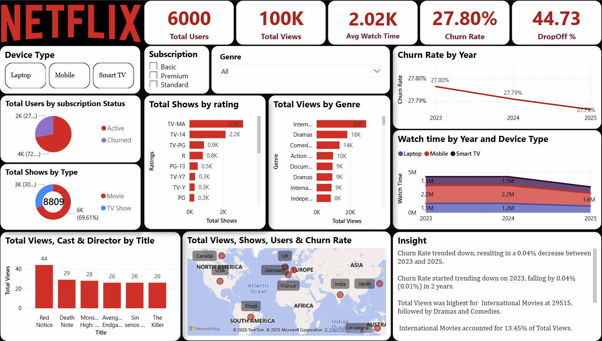
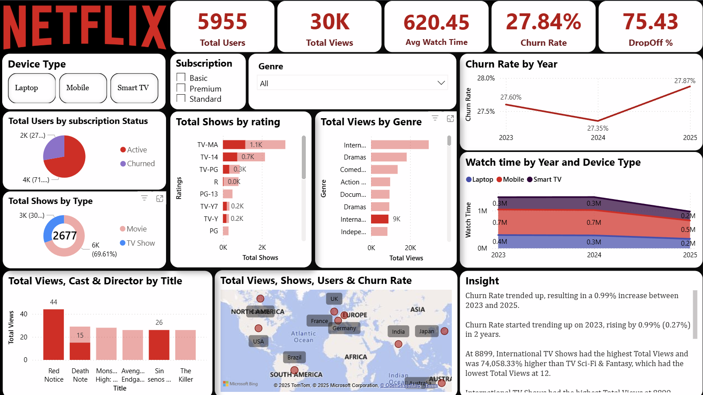
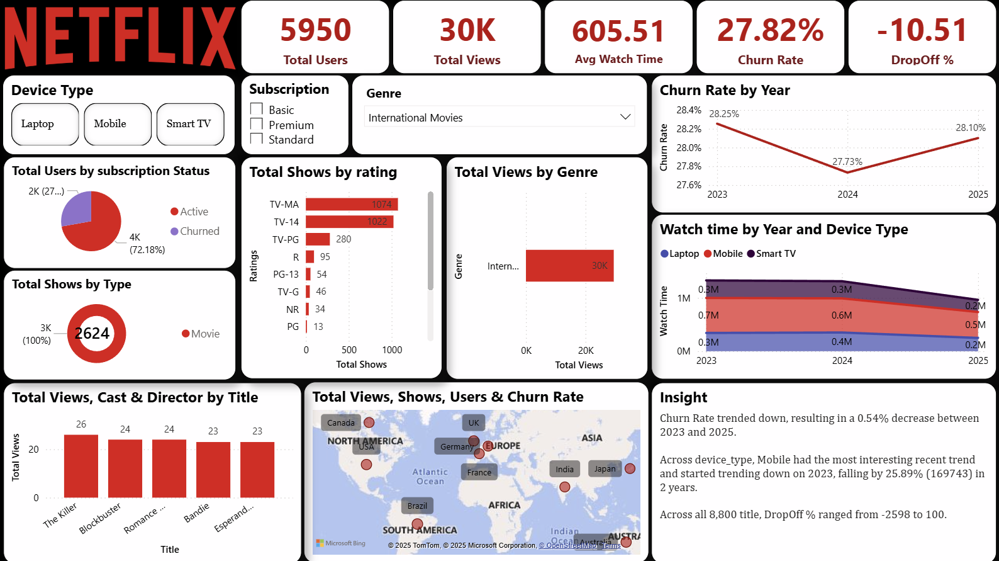

# 📊 Netflix User Analysis  

This project focuses on analyzing **Netflix user activity and content preferences** using **R for data cleaning & analysis** and **Power BI for dashboard visualization**.  

---

## 📂 Repository Structure  

```
├── Dataset
│ ├── netflix_titles.csv
│ ├── user_activity_dataset.csv
│
├── PDFs
│ ├── Insights.pdf
│ ├── Project Description.pdf
│
├── R_code
│ ├── project_netflix.R
│ ├── project_netflix.rmd
│
├── ScreenShorts
│ ├── Screenshot_1_r_cleaning.png
│ ├── Screenshot_2_r_Analysis.png
│ ├── Screenshot_3_powerBi_overview.png
│ ├── Screenshot_4_powerBi_laptop.png
│ ├── Screenshot_5_powerBi_TVshow.png
│ ├── Screenshot_6_powerBi_international.png
│
├── netflix.pbix # Power BI Dashboard File
└── README.md
```

---

## 🛠️ Tools & Technologies  

- **R Language** → Data Cleaning & Exploratory Analysis  
- **Power BI** → Interactive Dashboard & Visualizations  
- **CSV Dataset** → Netflix titles & user activity  

---

## 📑 Project Workflow  

1. **Data Cleaning (R)**  
   - Removed duplicates & null values  
   - Standardized categorical values  
   - Processed time-based features (watch time, churn trends)  

2. **Exploratory Data Analysis (R)**  
   - Content type distribution (Movies vs TV Shows)  
   - User segmentation (Mobile, Laptop, Basic plan users)  
   - Churn rate analysis  

3. **Dashboard Creation (Power BI)**  
   - User activity trends by device & subscription plan  
   - Churn analysis  
   - Regional breakdown  
   - Engagement with top titles  

---

## 🔑 Key Insights (Top 10)  

1️⃣ **International Movies dominate** → ~30K views overall (15K mobile, 13K basic)  
2️⃣ **Movies > TV Shows** → ~70% users prefer movies over episodic content  
3️⃣ **Mobile is the largest user base** → 50% of users (2992/6000) contribute ~50K views  
4️⃣ **Basic plan churn is highest** → 28.35% vs overall 27.8%  
5️⃣ **Basic plan churn increasing** → retention issue in lower pricing tier  
6️⃣ **Mobile engagement dropping** → watch time fell from 2.2M (2023–24) to 1.6M (2025)  
7️⃣ **Laptop usage rising in Basic plan** → watch time ↑ to 0.7M in 2025  
8️⃣ **Top Titles attract but don’t retain** → Red Notice & Monster High, but >44% churn  
9️⃣ **High Drop-off (~45%) across all segments** → need better personalization  
🔟 **Regional strength in India, USA, UK** → key regions for retention focus  

---

## 📸 Dashboard & Code Snapshots  

### 🔹 R Cleaning & Analysis  
#### 🔹Data Cleaning
  
#### 🔹 EDA
  

### 🔹 Power BI Dashboard
#### 🔹 Overview
  
#### 🔹 Laptop & Mobile - Filter
  
#### 🔹 TV Show - Filter
  
#### 🔹 International shows - Filter
  

---

## 📄 Reports  

- [Project Description](PDFs/Project%20Description.pdf)  
- [Insights Report](PDFs/Insights.pdf)  

---

## 🚀 How to Use  

1. Clone the repository:  
   ```bash
   git clone https://github.com/Anmol6790/Netflix_user_analysis.git
   cd Netflix_user_analysis
2. Open R_code/project_netflix.R for cleaning & analysis.

3. Open netflix.pbix in Power BI to explore the interactive dashboard.

4. Check PDFs/Insights.pdf for summarized insights.


## 📌 Conclusion

This analysis provides a comprehensive view of Netflix users’ preferences, churn patterns, and engagement trends.
It highlights the importance of regional targeting, retention strategies for Basic users, and device-based engagement optimization.

# 👨‍💻 Developed by Anmol6790

Would you like me to also add **badges** (e.g., R, Power BI, GitHub stars) and a **preview GIF of your dashboard** (from screenshots) to make your README look more professional?
